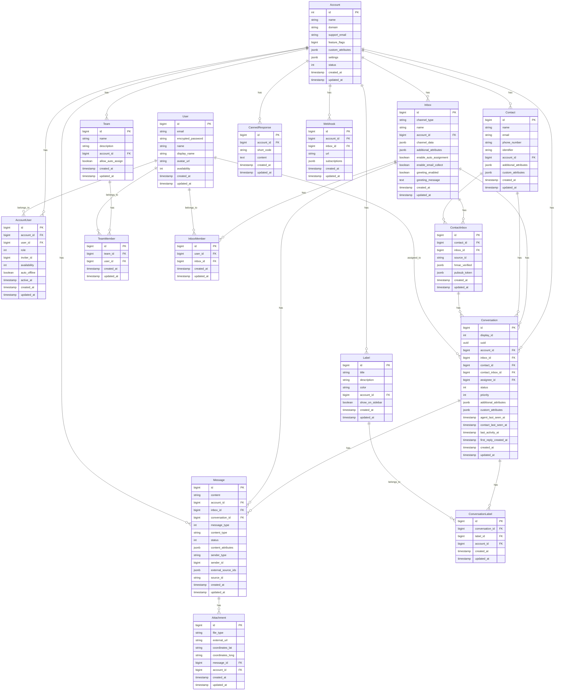
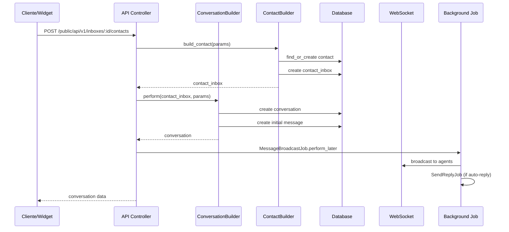
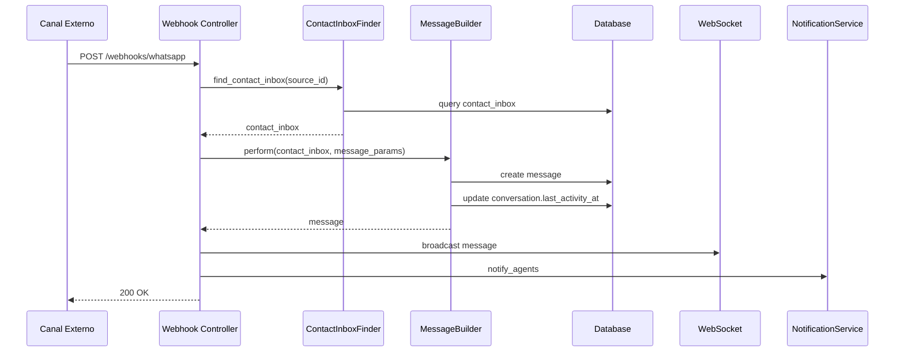
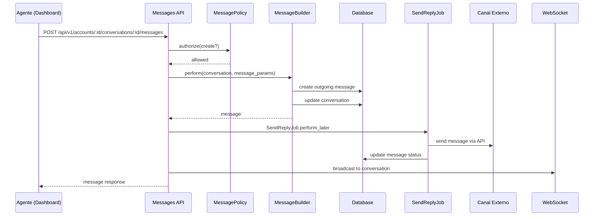
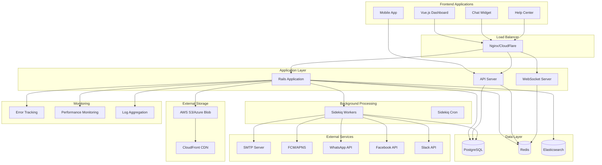
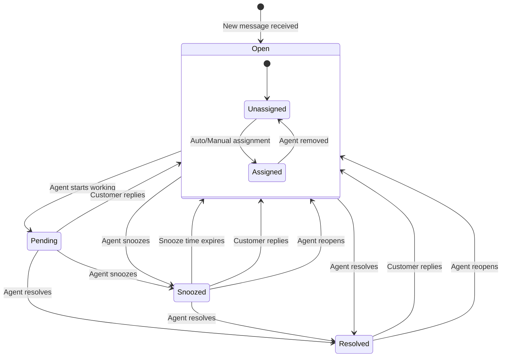
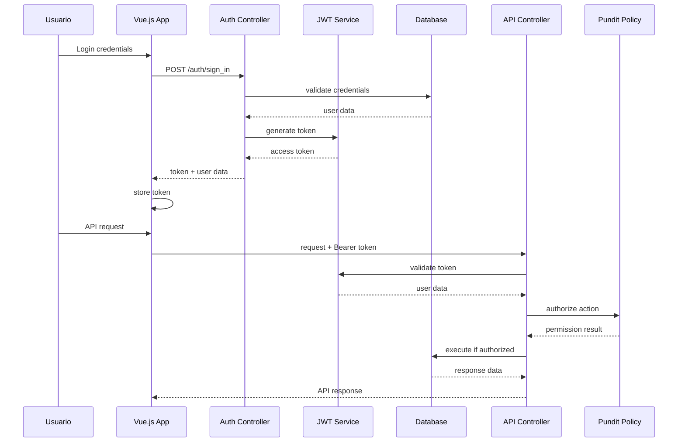
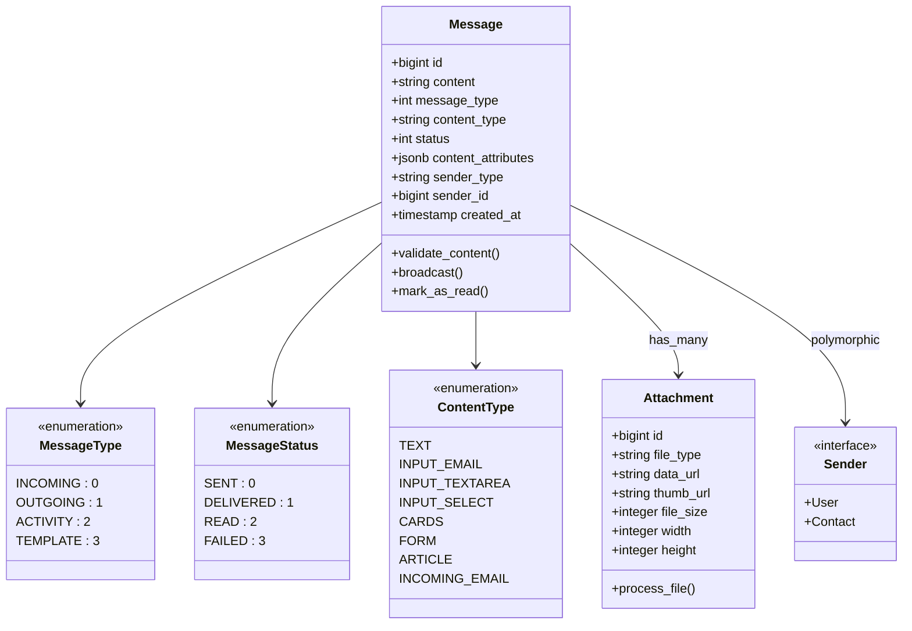
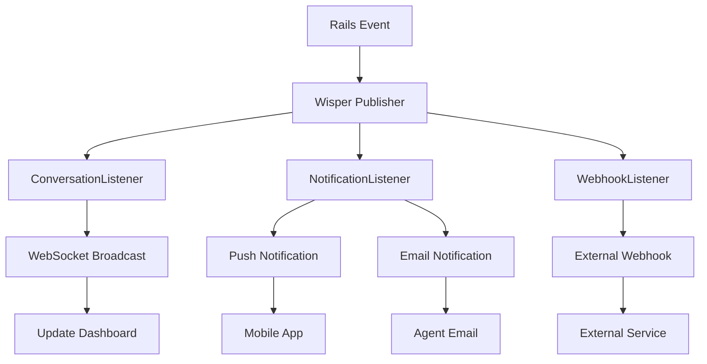
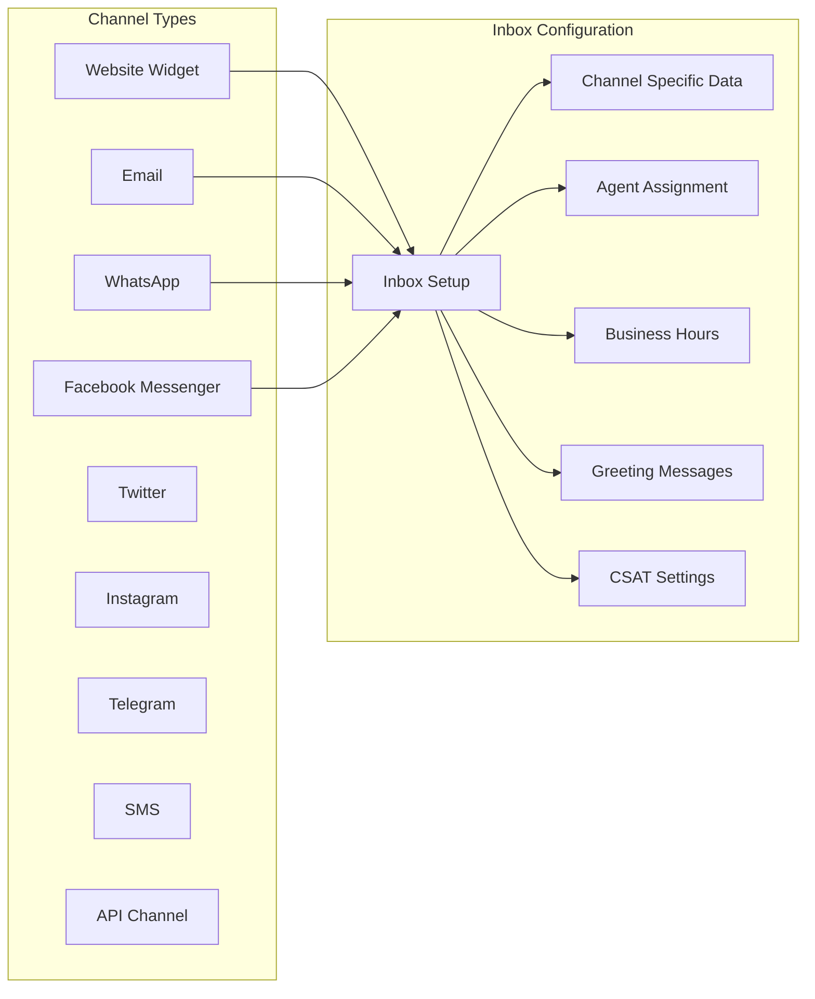

# Diagramas de Base de Datos y Flujos - Chatwoot

## Diagrama de Entidad-Relación (ERD) Detallado

## Flujo de Datos Detallado

### 1. Flujo de Creación de Conversación

### 2. Flujo de Mensaje Entrante (Webhook)

### 3. Flujo de Respuesta de Agente

## Diagrama de Arquitectura de Sistema

## Modelo de Estados de Conversación

## Flujo de Autenticación y Autorización

## Estructura de Datos de Mensaje

## Patrón de Event Broadcasting

## Configuración de Canales

Este documento complementa la documentación principal con diagramas visuales que ayudan a entender mejor la estructura de datos y los flujos del sistema Chatwoot.
